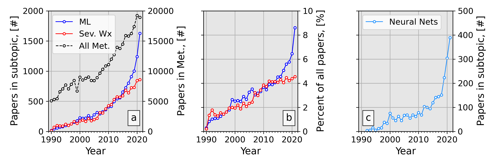
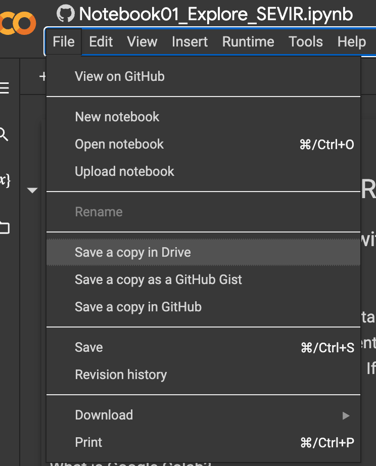

# WAF Tutorial Part 2: Neural Networks

THIS REPO IS IN ACTIVE DEVELOPMENT. PLEASE BE PATIENT 

## Introduction 
This repository is the code associated with the [WAF](https://journals.ametsoc.org/view/journals/wefo/wefo-overview.xml) manuscript titled: "A Machine Learning Tutorial for Operational Meteorology, Part II: Neural Networks" written by Chase, R. J., Harrison, D. R., Burke, A., Lackmann, G. and McGovern, A. *in prep*. While the paper undergoes review, feel free to read its [preprint](#) and provide any comments to via email to the corresponding author. If you have any issues with the code (bugs or other questions) please leave an [issue](https://github.com/ai2es/WAF_ML_Tutorial_Part2/issues) associated with this repo.

This second paper and repo (of two) covers *neural networks* and *deep learning* machine learning methods (if you don't know what these phrases even mean thats OK! Check out Section 2 in the paper). If you dont know what machine learning is, please check out paper one in this series found [here](https://journals.ametsoc.org/view/journals/wefo/37/8/WAF-D-22-0070.1.xml).

## Motivation

 

We showed this motivation in the previous part of the paper. Now we would like to draw your attention to subplot (c) where the number of meteorology papers with neural network methods are shown. This group of meteorology papers is growing rapidly. Thus, we have written this part of the tutorial to hopefully help meteorologists gain some intution and perspective about neural networks. 

## Background on the example dataset

Like part 1, we go beyond just discussing neural networks in an abstract way. We again use the [The Storm EVent ImagRy (SEVIR) dataset](https://proceedings.neurips.cc/paper/2020/file/fa78a16157fed00d7a80515818432169-Paper.pdf)


Unfortunately the original SEVIR dataset is far to combersome for most to deal with on their personal machines (the size of the data is almost 1 TB). So to assist in making an accessible and tangible sandbox dataset for this tutorial we made sub-SEVIR, which decreases the resolution of all variables to be 48 by 48 (~8km by 8km) and only take 1 hour of data instead of all 4 hours in the SEVIR dataset. The result is a much more magangable dataset (only 2 GB in storage now). So you can see the change in the dataset,[here](https://www.youtube.com/watch?v=ntjNB0SAz1Y) is a movie from the original SEVIR dataset and resolution for an example storm. The sub-SEVIR version can be seen [here](https://youtu.be/UAEfD1p5uW8). 

# Getting Started

There are two main ways to interact with the code here. 

## Use Google Colab 

   This is the recommended and the quickest way to get started and only requires a (free) google account. Google Colab is a cloud instance of python that is run from your favorite web browser (although works best in Chrome). If you wish to use these notebooks, navigate to the directory named ```colab_notebooks```. 
   
   Once in that directory, select the notebook you would like to run. There will be a button that looks like this once it loads: 

   

   Click that button and it will take you to Google Colab where you can run the notebook. Please note it does not save things by default, so if you would like to save your own copy, you will need to go to File -> save a copy in drive

   


   Google colab is awesome for those who do not know how to install python, or just dont have the RAM/HDD locally to do things. You can think of it this way. This notebook is just providing the instructions (i.e., code) to do what you want it to. Meanwhile the data and physical computer are on some Google machine somewhere, which will execute the code in the notebook. By default this google owned machine will have 12 GB of RAM and about 100 GB of HDD (i.e. storage). 
   
## Install python on your local machine and run notebooks there

   This is a bit more intense, especially for people who have never installed python on their machine. This method does allow you to always have the right packages installed and would enable you to actually download all of the SEVIR dataset if you want it (although it is very big... 924G total). 

   1. Setup a Python installation on the machine you are using. I
   recommend installing [Miniconda](https://docs.conda.io/en/latest/miniconda.html) since
   it requires less storage than the full Anaconda Python distribution. Follow
   the instructions on the miniconda page to download and install Miniconda
   for your operating system. It is best to do these steps in a terminal (Mac/Linux) or powershell (Windows)

      Once you get it setup, it would be good to have python and jupyter in this base environment.

      ``` $ conda install -c conda-forge python jupyterlab ``` 

   2. Now that conda is installed, clone this repository to your local machine with the command:

      ``` $ git clone https://github.com/ai2es/WAF_ML_Tutorial_Part2.git ``` 

      If you dont have git, you can install git ([Install Git](https://git-scm.com/book/en/v2/Getting-Started-Installing-Git)) or choose the "Download Zip" option, unzip it and then continue with these steps. 

   3. Change into the newly downloaded directory 

      ``` $ cd WAF_ML_Tutroial_Part2.git ``` 

   4. It is good practice to always make a new env for each project you work on. So here we will make a new environment  

      ``` $ conda env create -f environment.yml ``` 

   5. Activate the new environment 

      ``` $ conda activate waf_tutorial_part2 ``` 

   6. Add this new environement to a kernel in jupyter 

      ```$ python -m ipykernel install --user --name waf_tutorial_part2 --display-name "waf_tutorial_part2" ```

   7. Go back to the base environment 

      ```$ conda deactivate ``` 

   8. Start jupyter

      ``` $ jupyter lab ``` 

   9. You should be able to open the notebooks with this repository and you should be able to add the kernel we just installed with the name *waf_tutorial_part2*. To change from the default kernel, click on the ```kernels``` tab and select ```Change Kernel...``` and select the ```waf_tutorial_part2``` kernel.  
